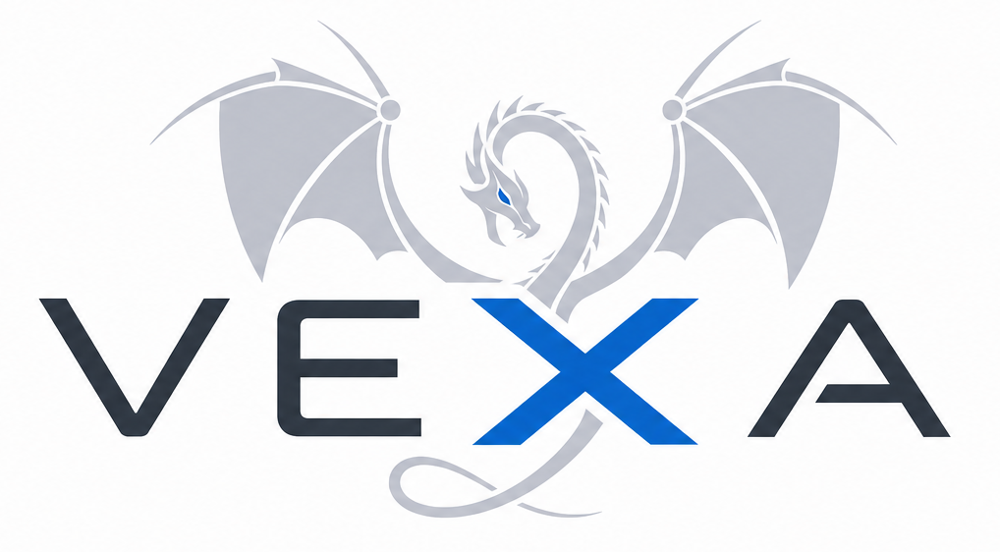

	

**VEXA** is a x86-64 targeted symbolic execution and LLVM IR lifting framework. It mainly focuses on lifting single functions that obfuscated or virtualized, optimizing/deobfuscating and recompiling them back into the binary.

- Lifts the machine code to the LLVM IR using ***remill***
- Emulates the lifted IR code using ***Z3***
- Applies binary patches and modifications using ***LIEF***

## Quickstart
