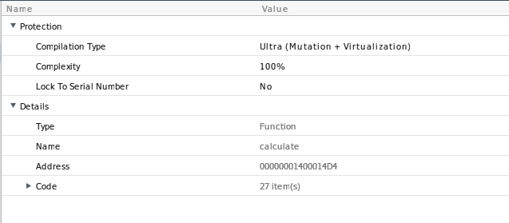
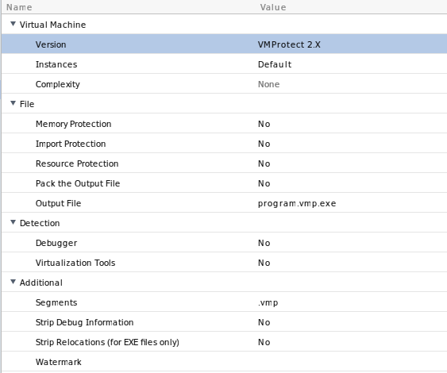
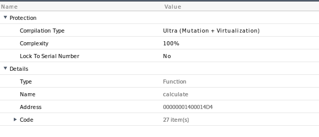
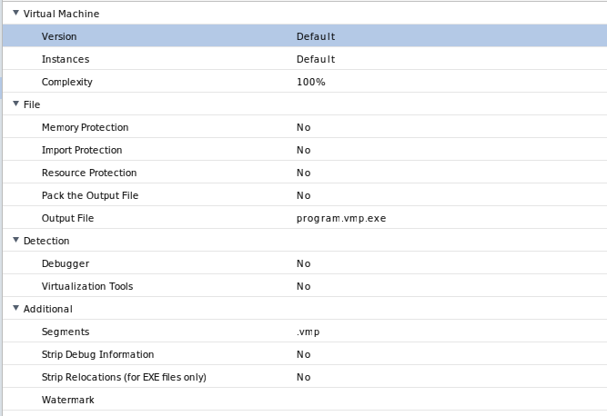

<p align="center">
  <picture>
    <source media="(prefers-color-scheme: dark)" srcset="resources/logo_dark.png">
    <source media="(prefers-color-scheme: light)" srcset="resources/logo_light.png">
    
  </picture>
</p>

**VEXA** is an x86-64 targeted symbolic execution and lifting framework built on LLVM. It mainly focuses on lifting single functions that obfuscated or virtualized, optimizing/deobfuscating and recompiling them back into the binary.

- Lifts the machine code to LLVM IR using ***remill***
- Emulates the lifted IR code using ***Bitwuzla***
- Applies binary patches and modifications using ***LIEF***

***This is just a hobby project and maintained only by me! I dont promise it will deobf/devirt any kind of commercial protection.*** 

## API Overview
The code below shows an example how to load a binary and lift the function with VEXA.
```cpp
#include <vexa/vexa.h>

int main()
{
  // initialize
  vexa::init();
  vexa::engine engine;

  // load and map binary
  vexa::binary bin("example.bin");
  engine.map_binary(bin);

  // explore and lift until recovering the function at 0x140001000
  engine.run(0x140001000);

  // apply optimizations
  engine.optimize();

  // print the lifted IR with statistics
  engine.print();

  // recompile the IR and insert in a new binary
  std::vector<uint8_t> recompiled = engine.recompile();
  engine.patch(bin, recompiled, 0x140001000);
  bin.write("output.bin");
}
```
## Example
Lets say we have this function:
```cpp
uint64_t calculate(uint64_t key)
{
    uint64_t x = 0;
    uint32_t state = 0x41;

    while (1)
    {
        switch (state)
        {
        case 0x41:
            x = key * 2;
            state = 0x93;
            break;

        case 0x93:
            x += 15;
            state = 0xDE;
            break;

        case 0xDE:
            return x;

        default:
            state = 0x41;
            break;
        }
    }
}
```
If we compile it and let VEXA to lift it:
```llvm
define ptr @vexa_lifted(ptr noalias %state, i64 %program_counter, ptr noalias %memory) {
entry:
  %RAX34 = getelementptr inbounds nuw i8, ptr %state, i64 2216
  %RDI39 = getelementptr inbounds nuw i8, ptr %state, i64 2296
  %0 = load i64, ptr %RDI39, align 8
  %1 = shl i64 %0, 1
  %2 = add i64 %1, 15
  store i64 %2, ptr %RAX34, align 8
  ret ptr %state
}

lifted          : 44 insts in 4ms
ir generated    : 991 ir-insts (×22.52 expansion)
optimized into  : 7 ir-insts (−99.29%)
```
It will symbolically execute the function from start to finish, solve the branches and recover the CFG.

# What can VEXA do?
Of course that was the least we can do. We have some advanced examples here to show you.
- [Covirt linear](#covirt-linear)
- [Covirt branches](#covirt-branches)
- [Covirt branches self-modifying code + MBA](#covirt-branches-self-modifying-code--mba)
- [Covirt symbolic loop](#covirt-symbolic-loop)
- [Covirt ranged loop](#covirt-ranged-loop)
- [VMProtect 2x branches ultra](#vmprotect-2x-branches-ultra)
- [VMProtect 3.3.1 branches ultra](#vmprotect-331-branches-ultra)
- [VMProtect 3.8.1 branches ultra](#vmprotect-381-branches-ultra)
- [Binaryshield](#binaryshield)
- Tigress (soon)

## Covirt linear
[Covirt](https://github.com/dmaivel/covirt) is a bin2bin code virtualizer with self-modifying code and mixed-boolean arithmetic obfuscations. It is a good studying example for developing a tool like VEXA. So I made the most of it. 

In this example, we will virtualize a pure linear function with covirt and see what we can do about it using VEXA.
```cpp
uint64_t calculate(uint64_t key)
{
	__covirt_vm_start();
	uint64_t x = key * 2 + 15;
	__covirt_vm_end();

	return x;
}
```
We virtualize it using covirt. I disable SMC and MBA for this, but I will cover them in the following examples.
```bash
./covirt calculate.bin -no_smc -no_mba
```

Then we run vexa-cli on the virtualized binary.
```bash
vexa-cli -i calculate.covirt -a 0x2150 -r
```
"-i" is the input binary, "-a" is the function VA and "-r" is recompiling and inserting in a new binary.

<picture>
	
</picture>

As you can see, we have successfully lifted the function, optimized and recompiled back as *output.bin* while preserving the semantics. But there are lots of unnecessary stores in the IR. These are VM's virtual stack operations and Vexa cant determine whether they are stores to global variables which is unoptimizable, or unnecessary virtual stack writes that should be deleted away. Hopefully in the future, we will have useful API's for virtual stack. But for now the quick solution is manually wiping away the stores.

```llvm
; Function Attrs: mustprogress nofree norecurse nosync nounwind willreturn memory(argmem: readwrite)
define ptr @vexa_lifted(ptr noalias returned captures(ret: address, provenance) initializes((2216, 2224)) %state, i64 %program_counter, ptr noalias readnone captures(none) %memory) local_unnamed_addr #0 {
entry:
  %RAX554 = getelementptr inbounds nuw i8, ptr %state, i64 2216
  %RDI559 = getelementptr inbounds nuw i8, ptr %state, i64 2296
  %0 = load i64, ptr %RDI559, align 8
  %1 = shl i64 %0, 1
  %2 = add i64 %1, 15
  store i64 %2, ptr %RAX554, align 8
  ret ptr %state
}
```
Another problem with the output is vexa doesnt recover the ABI (for now). So recompiled function is a little bit far from being 1:1. But it doesnt change the fact it runs.
```c
void main(long state)
{
  *(long *)(state + 0x8a8) = *(long *)(state + 0x8f8) * 2 + 0xf;
  return;
}
```
*Ghidra decompiled output of compiled object file of the IR above*

## Covirt branches
I will cover the rest of the examples as quick as possible, cause otherwise it will be too long.

This sample is classic multiple path forking example.

[Binary](tests/covirt-branches/covirt_branches.covirt)

[Test.cpp](tests/covirt-branches/test.cpp)

After manual cleanup of virtual stack stores

```llvm
; Function Attrs: mustprogress nofree norecurse nosync nounwind willreturn memory(argmem: readwrite)
define ptr @vexa_lifted(ptr noalias returned captures(ret: address, provenance) %state, i64 %program_counter, ptr noalias readnone captures(none) %memory) local_unnamed_addr #0 {
entry:
  %RAX1249 = getelementptr inbounds nuw i8, ptr %state, i64 2216
  %0 = load i64, ptr %RAX1249, align 8
  %RDI1254 = getelementptr inbounds nuw i8, ptr %state, i64 2296
  %1 = load i64, ptr %RDI1254, align 8
  switch i64 %1, label %MOVZX_GPR64_MEMw_388 [
    i64 1293, label %common.ret
    i64 911, label %common.ret
  ]

MOVZX_GPR64_MEMw_388:                             ; preds = %entry
  %2 = icmp eq i64 %1, 1453
  %3 = zext i1 %2 to i64
  br label %common.ret

common.ret:                                       ; preds = %entry, %entry, %MOVZX_GPR64_MEMw_388
  %4 = phi i64 [ %3, %MOVZX_GPR64_MEMw_388 ], [ 1, %entry ], [ 1, %entry ]
  %5 = and i64 %0, -256
  %6 = or disjoint i64 %4, %5
  store i64 %6, ptr %RAX1249, align 8
  ret ptr %state
}
```

## Covirt branches self-modifying code + MBA

[Binary](tests/covirt-branches-smc-mba/covirt-branches-smc-mba.covirt)

[Test.cpp](tests/covirt-branches-smc-mba/test.cpp)

I dont think covirt's MBA is really complex but it just blows up the every part of whole virtualized code, so it can easily run you out of ram during lifting.
Vexa can handle self-modifying code naturally, cause it emulates the whole memory during execution.

```cpp
uint64_t calculate(uint64_t key)
{
    uint64_t x = 0;
    if (key == 1293)
        x = key * 2 + 15;
    else
        x = key - 30;

    return x;
}
```
*Original function*


```bash
$ xmake test test-covirt-branches-smc-mba/run
running tests ...
[  0%]: running.test test-covirt-branches-smc-mba/run

report of tests:
[100%]: test-covirt-branches-smc-mba/run  passed 71.294s

100% tests passed, 0 test(s) failed out of 1, spent 71.295s
```
It takes 71 seconds in my machine to lift + optimize + recompile this sample.

```
lifted          : 266732 insts in 29887ms
ir generated    : 6967403 ir-insts (×26.12 expansion)
optimized into  : 615 ir-insts (−99.99%)
```
The statistics are wild, it produced nearly 7 millions IR instructions.

After manual cleanup of virtual stack + llvm -Oz optimizer
```llvm
; Function Attrs: mustprogress nofree norecurse nosync nounwind willreturn memory(argmem: readwrite)
define ptr @vexa_lifted(ptr noalias returned captures(ret: address, provenance) initializes((2216, 2224)) %state, i64 %program_counter, ptr noalias readnone captures(none) %memory) local_unnamed_addr #0 {
entry:
  %RDI266653 = getelementptr inbounds nuw i8, ptr %state, i64 2296
  %0 = load i64, ptr %RDI266653, align 8
  %1 = icmp eq i64 %0, 1293
  br i1 %1, label %common.ret, label %PUSHFQ_94237

PUSHFQ_94237:                                     ; preds = %entry
  %2 = tail call i64 @llvm.fshl.i64(i64 %0, i64 %0, i64 60)
  %3 = xor i64 %2, 3458764513820540926
  %4 = tail call i64 @llvm.fshl.i64(i64 %0, i64 %0, i64 39)
  %5 = and i64 %4, -15942918602753
  %6 = tail call i64 @llvm.fshl.i64(i64 %3, i64 %3, i64 4)
  %7 = tail call i64 @llvm.fshl.i64(i64 %5, i64 %5, i64 25)
  %8 = add i64 %7, %6
  %9 = tail call i64 @llvm.fshl.i64(i64 %0, i64 %0, i64 28)
  %10 = and i64 %9, -7784628225
  %11 = tail call i64 @llvm.fshl.i64(i64 %10, i64 %10, i64 36)
  %12 = add i64 %8, %11
  br label %common.ret

common.ret:                                       ; preds = %entry, %PUSHFQ_94237
  %13 = phi i64 [ %12, %PUSHFQ_94237 ], [ 2601, %entry ]
  %RAX266648 = getelementptr inbounds nuw i8, ptr %state, i64 2216
  store i64 %13, ptr %RAX266648, align 8
  ret ptr %state
}
```

A little amount of MBA is still there, but we can use [trailofbits/CoBRA](https://github.com/trailofbits/CoBRA) with some modifications (fshl support) to simplify the MBA.

```llvm
; Function Attrs: mustprogress nofree norecurse nosync nounwind willreturn memory(argmem: readwrite)
define ptr @vexa_lifted(ptr noalias returned captures(ret: address, provenance) initializes((2216, 2224)) %state, i64 %program_counter, ptr noalias readnone captures(none) %memory) local_unnamed_addr #0 {
entry:
  %RDI266653 = getelementptr inbounds nuw i8, ptr %state, i64 2296
  %0 = load i64, ptr %RDI266653, align 8
  %1 = icmp eq i64 %0, 1293
  %cobra.add = add i64 %0, -30
  %spec.select = select i1 %1, i64 2601, i64 %cobra.add
  %RAX266648 = getelementptr inbounds nuw i8, ptr %state, i64 2216
  store i64 %spec.select, ptr %RAX266648, align 8
  ret ptr %state
}
```

## Covirt symbolic loop
Handling loops in VM obfuscation or generally any obfuscation method similar to CFF is more complex than just letting execution flow. What I do in VEXA is identify dispatcher jumps with techniques similar to pattern matching, and tracing the VPC through the execution. These are enough to rebuild the virtual CFG. VEXA can handle the rest. We have APIs for the job.

[Binary](tests/covirt-symbolic-loop/covirt_symbolic_loop.covirt)

[Test.cpp](tests/covirt-symbolic-loop/test.cpp)

This technique is VM specific, so we have to analyze how the VM works, especially where does it dispatch the VM bytecode. In covirt, I figured out that at the first indirect jump R9 has the handler table pointer. And RAX is the VPC. We need the handler table address because in VM there are initializer-like blocks between handlers so we have to determine which indirect jump is the real dispatcher. After identifying the dispatchers and VPC, we can write a code like below.

```cpp
bool first_dispatch = true;
uint64_t handler_table;
auto v_dispatch = [&](vexa::engine &e) -> void {
    auto cpu = e.get_cpu();
    vexa::value *r9 = e.get_cpu()->read_register(vexa::amd64::R9);

    // find the handler table from first indirect jump
    if (first_dispatch) {
        handler_table = r9->as_uint64();
        first_dispatch = false;
        std::cout << "Found handler table: " << std::hex << r9->as_uint64() << std::endl;
    }
    else {
        // when we come to another indirect jump, check if R9 holds the handler table we found before
        if (r9->as_uint64() == handler_table) {
            uint64_t VPC = cpu->read_register(vexa::amd64::RAX)->as_uint64();
            // give the info to vexa so it can rebuild the vcfg
            cpu->VPC = VPC;
            cpu->VJMP = true;
            std::cout << "Next VPC: " << std::hex << VPC << std::endl;
        }
    }
};

engine.set_callback(vexa::event_kind::INDIRECT_JUMP, v_dispatch);
engine.set_option(vexa::option::MODE, vexa::mode_t::VCFG_RECOVERY);
```
With this, we are able to rebuild the virtual CFG and recompiled binary works. But the thing is, VEXA still struggles with loops generally. Erasing virtual stack stores is not enough for this one. Take a look at [output.ll](tests/covirt-symbolic-loop/output.ll) and you will see what I mean. I'm not sure how to make this better but it will stay as a limitation for now.

## Covirt ranged loop
The approach above has an edge-case, ranged loops.

Normally, we are able to solve this loop:
```cpp
for (int i = 0; i < symbolic_var; i++)
  x += i;
```
But when it comes to this, it fails.
```cpp
for (int i = 0; i < 16; i++)
  x += i;
```
VEXA has an option named OPAQUE_SOLVING, which lets us solve branch conditions during lifting and do not fork paths if the condition is concrete. But it causes an edge case here because in the example above, loop condition will be always concrete. "i" is either less than 16 or it is not. I'm sure there are better ways to overcome this issue but what I did is manually tracing the VPC's and identifying the VPC that is responsible from checking loop condition. And turn off the OPAQUE_SOLVING for that VPC. I did a simple check like below:

```cpp
// you need to find the vpc of virtual branching instruction that is responsible from loop condition
// there are many ways to do that
//
if (VPC == 0xe041)
  e.set_option(vexa::option::OPAQUE_SOLVING, 0);
else
  e.set_option(vexa::option::OPAQUE_SOLVING, 1);
```

[Binary](tests/covirt-ranged-loop/covirt-ranged-loop.covirt)

[Test.cpp](tests/covirt-ranged-loop/test.cpp)

[Output.ll](tests/covirt-ranged-loop/output.ll)

## VMProtect 2x branches ultra
Original function:

```cpp
uint64_t calculate(uint64_t key)
{
    uint64_t x = 0;
    if (key == 1293)
        x = key * 2 + 15;
    else
        x = key - 30;

    return x;
}
```
Virtualizing it with VMP 2x.

<picture>
	
</picture>

<picture>
	
</picture>

After lifting [Output.ll](tests/vmp2-branches-ultra/output.ll)

We recovered the control flow but the arithmetics are obfuscated due to VMP's ultra obfuscation. We can use [trailofbits/CoBRA](https://github.com/trailofbits/CoBRA) here again.

```llvm
define ptr @vexa_lifted(ptr noalias returned captures(ret: address, provenance) initializes((2216, 2224)) %state, i64 %program_counter, ptr noalias readnone captures(none) %memory) local_unnamed_addr #0 {
entry:
  %RCX95892 = getelementptr inbounds nuw i8, ptr %state, i64 2248
  %0 = load i64, ptr %RCX95892, align 8
  %1 = sub i64 1292, %0
  %2 = sub i64 -9223372036854774515, %0
  %3 = and i64 %2, %1
  %4 = shl i64 %0, 1
  %5 = add i64 %4, 15
  %6 = add i64 %0, -30
  %7 = icmp slt i64 %3, 0
  %8 = select i1 %7, i64 %5, i64 %6
  %RAX95890 = getelementptr inbounds nuw i8, ptr %state, i64 2216
  store i64 %8, ptr %RAX95890, align 8
  ret ptr %state
}
```

## VMProtect 3.3.1 branches ultra
VMProtect 3.3.1 was the most difficult one in the VMP versions for me. It needed some custom solutions for solving the opaque predicates (or junk codes, not sure what should I call them) and virtual branches.

[Binary](tests/vmp3.3.1-branches-ultra/vmp3.3.1-branches-ultra.exe)

[Test.cpp](tests/vmp3.3.1-branches-ultra/test.cpp)

[Output.ll](tests/vmp3.3.1-branches-ultra/output.ll) still has the MBA but CoBRA will do the job.

```llvm
define ptr @vexa_lifted(ptr noalias returned captures(ret: address, provenance) initializes((2216, 2224)) %state, i64 %program_counter, ptr noalias readnone captures(none) %memory) local_unnamed_addr #0 {
entry:
  %RCX53521 = getelementptr inbounds nuw i8, ptr %state, i64 2248
  %0 = load i64, ptr %RCX53521, align 8
  %.not = icmp eq i64 %0, 1293
  %1 = add i64 %0, -30
  %2 = select i1 %.not, i64 2601, i64 %1
  %RAX53519 = getelementptr inbounds nuw i8, ptr %state, i64 2216
  store i64 %2, ptr %RAX53519, align 8
  ret ptr %state
}
```

## VMProtect 3.8.1 branches ultra
VMP 3.8.1 was not much different from VMP 2x. So there is nothing special about it.

<picture>
	
</picture>

<picture>
	
</picture>

[Binary](tests/vmp3.8.1-branches-ultra/vmp3.8.1-branches-ultra.exe)

[Test.cpp](tests/vmp3.8.1-branches-ultra/test.cpp)

```llvm
define ptr @vexa_lifted(ptr noalias %state, i64 %program_counter, ptr noalias %memory) {
entry:
  %RCX43886 = getelementptr inbounds nuw i8, ptr %state, i64 2248
  %0 = load i64, ptr %RCX43886, align 8
  %1 = sub i64 1292, %0
  %2 = sub i64 -9223372036854774515, %0
  %3 = and i64 %2, %1
  %4 = add i64 %0, -30
  %5 = shl i64 %0, 1
  %6 = add i64 %5, 15
  %7 = icmp slt i64 %3, 0
  %8 = select i1 %7, i64 %6, i64 %4
  %RAX43884 = getelementptr inbounds nuw i8, ptr %state, i64 2216
  store i64 %8, ptr %RAX43884, align 8
  ret ptr %state
}
```
CoBRA isn't needed here.

## BinaryShield

Binaryshield was an old sample I worked on before. So I wanted to put it in here too.

[Binary](tests/binaryshield/binaryshield.exe)

[Test.cpp](tests/binaryshield/test.cpp)

```llvm
define ptr @vexa_lifted(ptr noalias %state, i64 %program_counter, ptr noalias %memory) {
entry:
  %RCX51274 = getelementptr inbounds nuw i8, ptr %state, i64 2248
  %0 = load i64, ptr %RCX51274, align 8
  %1 = trunc i64 %0 to i32
  switch i32 %1, label %common.ret.fold.split [
    i32 1859, label %common.ret
    i32 2418, label %common.ret
    i32 1638, label %common.ret
    i32 299902, label %common.ret
    i32 29763, label %common.ret
  ]

common.ret.fold.split:                            ; preds = %entry
  br label %common.ret

common.ret:                                       ; preds = %entry, %entry, %entry, %entry, %entry, %common.ret.fold.split
  %2 = phi i64 [ 1, %entry ], [ 0, %common.ret.fold.split ], [ 1, %entry ], [ 1, %entry ], [ 1, %entry ], [ 1, %entry ]
  %RAX51272 = getelementptr inbounds nuw i8, ptr %state, i64 2216
  store i64 %2, ptr %RAX51272, align 8
  ret ptr %state
}
```

## Limitations
For now:
  - Flexibility is the main issue. Samples in the wild will need lots of modifications in the lifting process. API is not flexible enough.
  - Lifting API calls are not supported.
  - Virtual stack is a problem against optimizing the IR.
  - Need a better memory model, for now vexa constant folding global variables that normally shouldn't.
  - [Constant Propagation Pass](src/passes/constant_propagation_memory.cpp) still can fail on some edge-case samples.
  - Not tested on samples with try-catch
  - We support switch-cases but not tested it thoroughly.
  - I'm not sure if windows build is possible, bitwuzla and remill relies on different compilers in windows.
  - Bugs are always expected, and I always welcome the reports, especially with solutions.

## Conclusion
VEXA might not be ready for real world samples yet, but I think it has a great potential. This is why I'm releasing it as open source. I'm not a professional and making these only out of personal interest. So I appreciate every kind of help coming from the community.

# Building
***VEXA uses [a modified version of remill](https://github.com/mmert11/remill), original repo wont work! Just clone the repo with --recursive.***

VEXA uses xmake for building. Follow the steps for building it.

## Linux
### Install requirements
```bash
sudo apt install build-essential cmake ninja-build python3 python3-pip pkg-config libgmp-dev libmpfr-dev git curl meson 7zip libzstd-dev libtinfo-dev libxml2-dev zlib1g-dev
```
### Build and install LLVM 22+
```bash
git clone --branch llvmorg-22.1.6 --depth 1 https://github.com/llvm/llvm-project.git
cd llvm-project
cmake -S llvm -B build -G Ninja \
  -DCMAKE_BUILD_TYPE=Release \
  -DLLVM_ENABLE_PROJECTS="clang" \
  -DLLVM_TARGETS_TO_BUILD="X86;AArch64;ARM;Sparc" \
  -DLLVM_ENABLE_RTTI=ON \
  -DLLVM_ENABLE_ASSERTIONS=OFF
cmake --build build -j$(nproc)
cmake --install build
```
### Get xmake
```bash
curl -fsSL https://xmake.io/shget.text | bash
source ~/.xmake/profile
```
### Build VEXA
```bash
git clone https://github.com/mmert11/vexa.git --recursive
cd vexa
xmake -j8
```